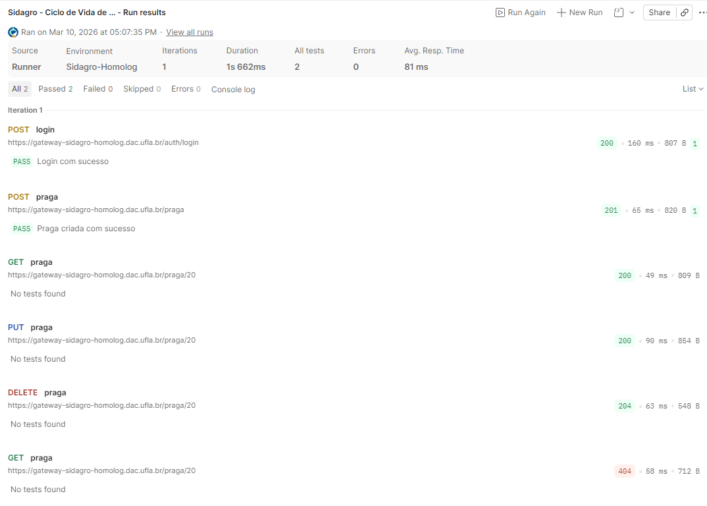
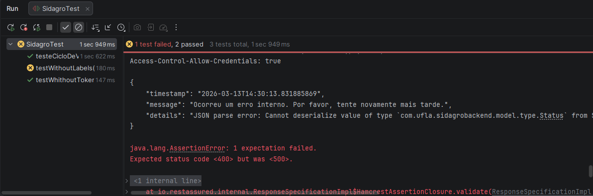

# Automação de Testes de API - Projeto Sidagro (Semana 2)

## 📌 Objetivo do Projeto

Este projeto compõe a entrega da **Semana 2 do Onboarding da Equipe de Testes**, com o objetivo de estruturar, implementar e validar uma suíte de testes automatizados para a API REST do sistema Sidagro.

O módulo escolhido para a cobertura de testes foi o **Módulo de Pragas (`/praga`)**, devido à sua importância no domínio de negócio agropecuário e por possuir um ciclo de vida de dados completo (CRUD).

## 🛠️ Tecnologias Utilizadas

Para garantir uma arquitetura escalável e aderente aos padrões de mercado, o projeto foi construído utilizando:

* **Linguagem:** Java 17
* **Gerenciador de Dependências:** Maven
* **Framework de Testes da API:** REST-assured 6.0.0
* **Motor de Execução:** JUnit 5 (Jupiter)
* **Serialização de Dados:** Jackson Databind 2.21.1 (Para mapeamento de POJOs)
* **Ferramenta de Exploração Manual:** Postman

---

## 🏗️ Estrutura do Projeto e Boas Práticas (Arquitetura)

O projeto foi estruturado visando estabilidade, manutenibilidade e aplicação do princípio **DRY (Don't Repeat Yourself)**.

### Decisões Arquiteturais:

1. **Mapeamento via POJO (Plain Old Java Object):**
* Em vez de utilizar `Strings` com formato JSON de forma estática e propensa a erros de sintaxe no corpo das requisições, foi criado o pacote `pojo` contendo a classe `Praga.java`. O Jackson Databind converte os objetos Java nativos para JSON automaticamente, tornando o código limpo e facilitando futuras manutenções caso o contrato da API mude.
2. **Setup Dinâmico com `@BeforeAll`:** 
* A geração do Token JWT não foi repetida em cada teste. Utilizou-se a anotação `@BeforeAll` do JUnit para que a requisição de `/auth/login` ocorra **apenas uma vez** antes da suíte inteira rodar, armazenando o token em uma variável estática para todos os métodos. Isso reduz o tempo de execução e evita gargalos no servidor de autenticação.
3. **Testes de Ciclo de Vida End-to-End (E2E):**
* O teste `testeCicloDeVidaPraga` não testa os endpoints de forma isolada. Ele cria o registro (POST), extrai o `id` gerado pelo banco dinamicamente usando `.extract().path("id")`, e repassa esse mesmo `id` para os testes subsequentes de busca (GET), alteração (PUT) e exclusão (DELETE). O teste é encerrado com um GET 404, garantindo que o banco de dados não fique poluído com lixo de testes (Teardown).


---

## 🧪 Cenários de Teste Implementados

Foram desenvolvidos cenários positivos (Caminho Feliz) e negativos (Exceções):

* `testeCicloDeVidaPraga()` **[POSITIVO]**: Valida o fluxo completo. Afere *Status Code* (201, 200, 204, 404) e utiliza a biblioteca Hamcrest para validar o *Corpo da Resposta* (`nomePopular` e `nomeCientifico`).
* `testWhithoutToken()` **[NEGATIVO]**: Valida a segurança do endpoint, injetando um header de autorização inválido e esperando o bloqueio com status 403 (Forbidden).
* `testWithoutLabels()` **[NEGATIVO]**: Valida a obrigatoriedade de campos ao enviar strings vazias e Enums incorretos, esperando a resposta 400 (Bad Request). *(Observação: Este cenário revelou um defeito documentado no Bug Report abaixo).*

---

## 🐞 Bug Report Oficial

Durante a execução automatizada dos cenários negativos (`testWithoutLabels`), foi identificado um comportamento anômalo no tratamento de exceções do sistema.

* **Título:** Retorno `500 Internal Server Error` ao enviar payload com campos de formulário vazios e enumeração inválida na rota POST `/praga`.
* **Ambiente:** Homologação (`gateway-sidagro-homolog.dac.ufla.br`)
* **Passos para reproduzir:**
  1. Gerar um token JWT válido.
  2. Fazer uma requisição `POST` para `/praga`.
  3. Enviar o body com o status inexistente (`INVALIDO`) e demais dados vazios:
```json
{ "nomePopular": "", "nomeCientifico": "", "status": "INVALIDO" }
```


* **Comportamento Esperado:** A API deveria interceptar o erro de negócio/validação e retornar **Status Code 400 (Bad Request)** com uma mensagem amigável ao usuário (ex: *"Status informado não é válido"*).
* **Comportamento Obtido (Atual):** A API falha em desserializar o objeto e retorna um Crash do Servidor com **Status Code 500**.
* **Evidência do Log (Stacktrace capturado pela automação):**
> `JSON parse error: Cannot deserialize value of type com.ufla.sidagrobackend.model.type.Status from String "INVALIDO": not one of the values accepted for Enum class: [INATIVO, SUSPENSO, ATIVO]`


---

## 🚀 Atividade Complementar: Postman e Análise

Antes da automação, a API foi explorada manualmente via Postman para validação de contrato e testes exploratórios. O workspace pode ser visualizado no link abaixo:

🔗 **[Acessar Workspace do Postman (Sidagro API Tests)](https://gustavo-almeida2-396174.postman.co/workspace/sidagro-api-tests~12f5caaf-5a81-4040-b3f9-474b7c2c8dbf/collection/53084778-da5b3b84-cee4-4726-8a4f-08da2730f404?action=share&creator=53084778&active-environment=53084778-8bc40b0d-165a-4615-850a-c3aa25d3e1fb)**



### 📊 Comparativo: Execução Manual (Postman) x Automatizada (Java/RestAssured)

A execução exploratória utilizando o **Postman** provou-se essencial no início do ciclo. Ela permitiu interagir com o Swagger de forma visual, mapear a estrutura do JSON esperada e configurar scripts simples de injeção de variáveis de ambiente. É uma ferramenta excepcional para desenvolvimento e debriefing rápido.

No entanto, a criação da suíte **Automatizada com Java e REST-assured** demonstrou superioridade absoluta para a esteira de Engenharia de Qualidade. A automação permitiu:

1. Executar o ciclo de vida completo de uma Praga (Create, Read, Update, Delete) em pouco mais de 1 segundo de forma invisível.
2. Isolar os dados de payload em estruturas robustas (POJOs), garantindo a tipagem segura dos dados no Java.
3. Eliminar a dependência de intervenção humana (clicar em *Send* sucessivamente), viabilizando futuramente a integração desses testes em uma pipeline de CI/CD (ex: GitLab CI), assegurando a prevenção imediata contra defeitos de regressão a cada nova atualização do sistema.

Mandou muito bem nos logs, Gustavo! Esse nível de detalhamento é exatamente o que um revisor técnico busca. Como você tem um **Bug Report** no meio do seu README, a falha do teste `testWithoutLabels` (o "X" vermelho no print) não é um problema, mas sim a **prova** de que seu teste automatizado encontrou um erro no sistema.

Aqui está a seção formatada para você copiar e colar. Recomendo colocar **ao final do README**, logo após a seção de comparativo Postman x Automação.

---

## 📊 Evidências de Execução

A suíte de testes foi executada localmente utilizando o runner do JUnit 5. Abaixo, constam as evidências de sucesso e a captura do erro que originou o Bug Report.

### 📸 Resumo da Execução (IDE)

*Legenda: Execução completa da suíte. O teste `testWithoutLabels` falha conforme esperado, evidenciando o retorno 500 da API.*

### 📄 Logs Detalhados por Cenário

Abaixo, os logs capturados via console mostram a interação real com os endpoints:

#### 1. Autenticação e Ciclo de Vida (CRUD)
O sistema realiza o login e utiliza o token para criar, buscar, atualizar e deletar a praga.
> **Status:** ✅ Sucesso
```text
HTTP/1.1 200 OK (Login realizado)
{ "token": "eyJhbGciOi..." }

HTTP/1.1 201 Created (POST /praga)
{ "id": 38, "nomePopular": "Teste Popular", "status": "ATIVO" }

HTTP/1.1 200 OK (GET /praga/38)
HTTP/1.1 200 OK (PUT /praga/38 - Dados alterados)
HTTP/1.1 204 No Content (DELETE /praga/38)
HTTP/1.1 404 Not Found (GET /praga/38 - Teardown confirmado)
```

#### 2. Validação de Segurança (Sem Token)

Tentativa de acesso sem credenciais válidas.

> **Status:** ✅ Sucesso

```text
HTTP/1.1 403 Forbidden
(Acesso negado conforme esperado)
```

#### 3. Validação de Regras de Negócio (Campos Inválidos)

Envio de enumeração inexistente (`INVALIDO`).

> **Status:** ❌ Falha (Bug Identificado)

```text
java.lang.AssertionError: Expected status code <400> but was <500>.
{
    "message": "Ocorreu um erro interno. Por favor, tente novamente mais tarde.",
    "details": "JSON parse error: Cannot deserialize value of type ...Status from String \"INVALIDO\""
}
```

---

